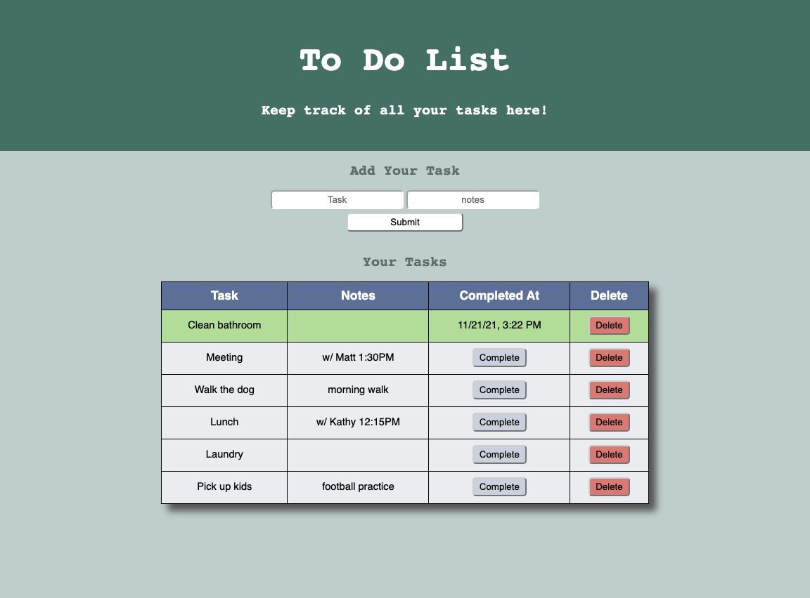

# Weekend To Do List App

## Description

*Duration: Weekend Project*

This to do list is a fullstack full CRUD app. Users can input tasks and any notes they may want to add in the supplied fields. The task will be stored in the server and displayed in the table for easy reading. The complete button will record the time completed and also update the color of the task to show its new status. Users can also delete a task if their table is getting too full or if they don't need to do that task anymore.

## Screen Shot
___



### Prerequisites

- Node.js
- Postgresql
- Sweetalert

## Installation
___

1. Fork and clone.
2. Type ```npm init --yes``` into the in-app terminal.
3. Once thats done type ```npm install``` in the IDE terminal.
4. You'll have to set up the database in postgresql. Make sure you name it 'weekend-to-do-app'.
5. Then set up the table by taking the commands in the database.sql file in the IDE and running them in postgresql.
6. Start your server by typing ```npm start``` in the IDE terminal.
7. Everything is good to go now! Don't forget to shut down your server when you're done!

## Usage
___

1. Input your tasks and any notes you have into the provided input fields.
2. Click the submit button.
3. When your task is complete hit the Complete button in the table and it will record the time and display it with a fancy new color for you.
4. If you need to delete a task for any reason, just hit the delete button and you'll be prompted to confirm it. (Don't want to accidentally delete something!)

## Built With
___

- jQuery
- JavaScript
- Node.js
- Express
- PostgreSQL
- Sweetalert
- HTML/CSS

## Acknowledgement
___

Thanks to Prime Digital Academy who equipped and helped me to make this application a reality. Special thanks to my instructor [Matthew Black](https://github.com/matthew-black)!

## Support
___

If you have suggestions or issues, please email me at [kayla.mir32@gmail.com](mailto:kayla.mir32@gmail.com).  